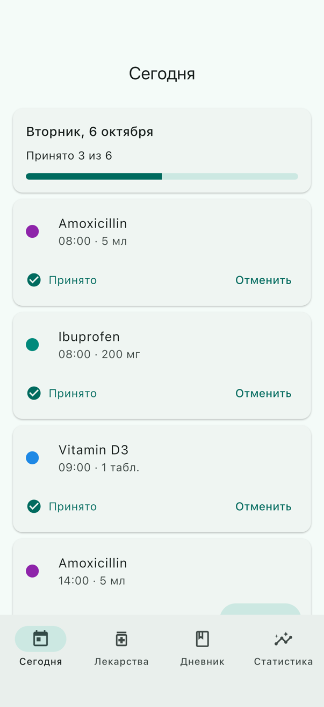
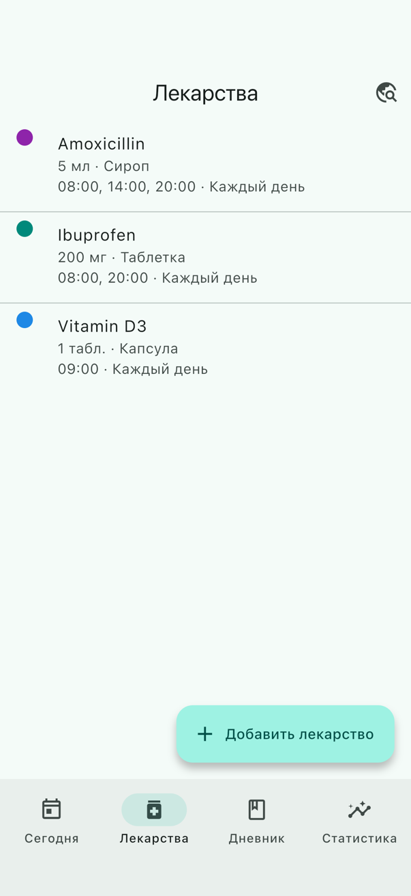
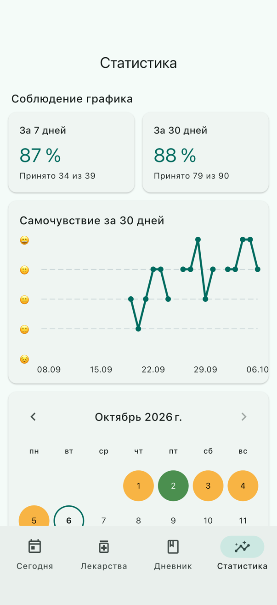
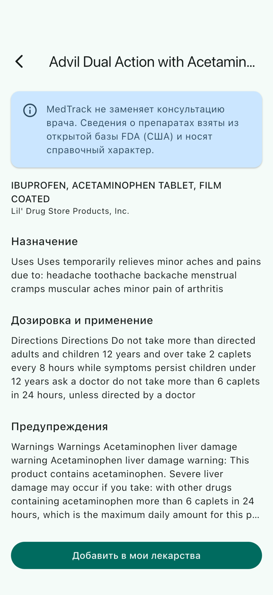
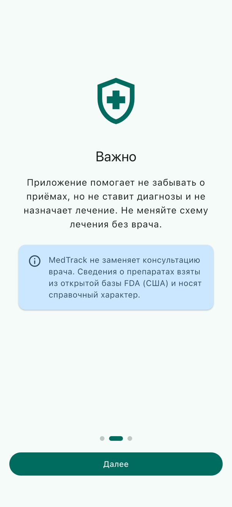
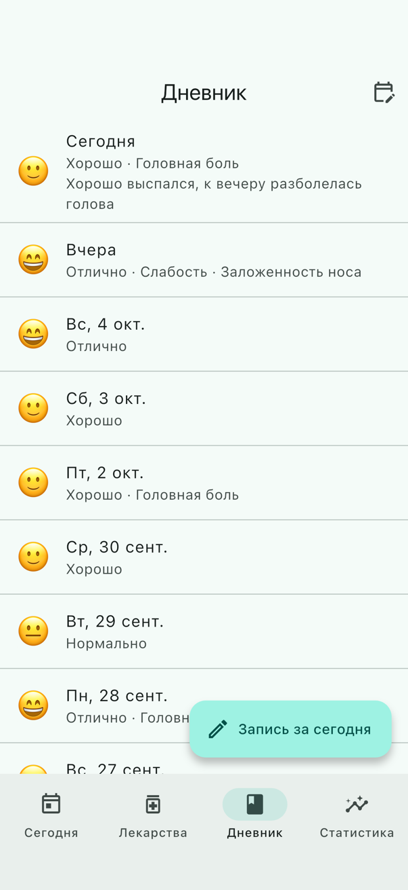
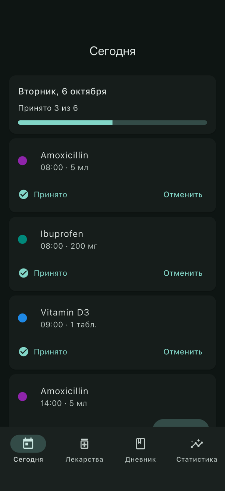
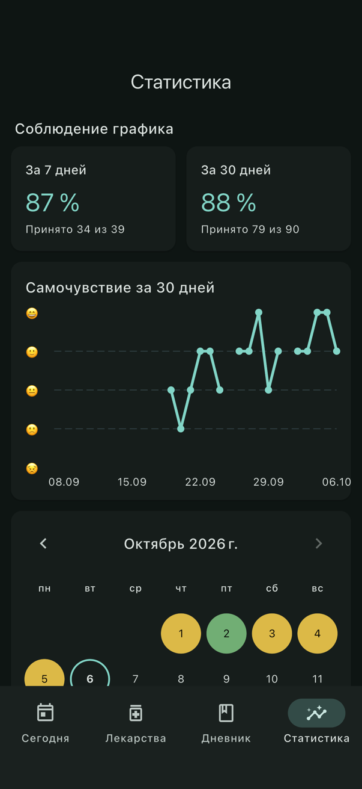
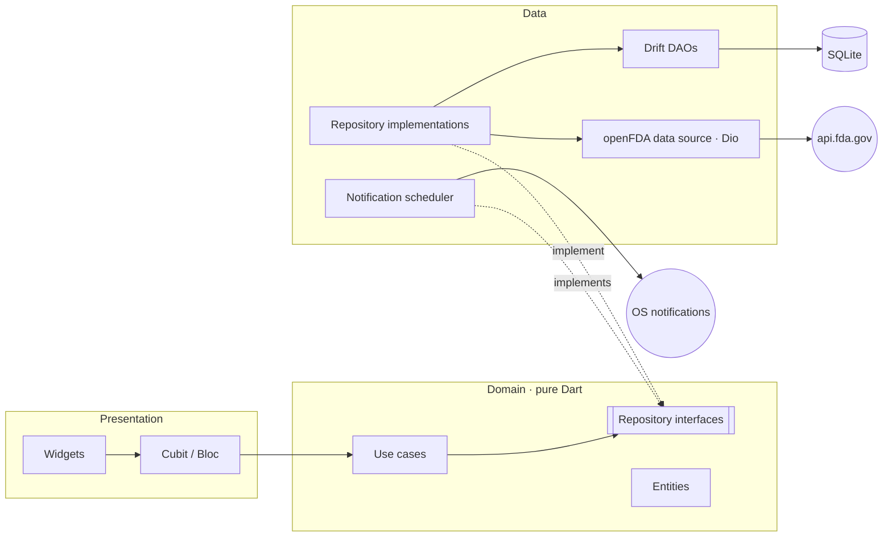

# MedTrack

[](https://github.com/Gervantt/Medication-tracker/actions/workflows/ci.yml)

A medication and wellbeing tracker built with Flutter. You add your medications and their schedules,
get reminders at intake time, mark doses as taken or skipped (also straight from the notification),
keep a daily wellbeing diary and see adherence statistics. Drug information comes from the
public [openFDA](https://open.fda.gov/apis/drug/label/) database.

The UI is in Russian; the code, comments and commits are in English.

> **Disclaimer.** MedTrack does not replace a doctor's advice. Drug information comes from the US FDA
> database and is for reference only.

## Screenshots

| Today | Medications | Statistics | Drug details |
|:---:|:---:|:---:|:---:|
|  |  |  |  |
| **Onboarding** | **Diary** | **Today, dark** | **Statistics, dark** |
|  |  |  |  |

The screenshots are generated by an integration test with demo data (see [Screenshots](#screenshots-1)).

## Features

- **Medications**: add, edit and delete medications with dosage (mg, ml, tablets), form, several intake
  times a day, every day or specific weekdays, course start and end dates, a note and a color label.
- **Today**: the day's intakes in time order with "Taken" and "Skipped" buttons, undo and a day progress
  bar.
- **Reminders**: local notifications at intake time with a "Taken" action that works while the app is
  closed. Reminders are rescheduled after any change and survive a device reboot.
- **Diary**: a daily entry with an emoji mood scale (1–5), symptom tags (predefined and custom) and a note.
- **Statistics**: adherence for the last 7 and 30 days, a mood chart, and a month calendar colored by
  how the day's intakes went.
- **Drug search**: debounced search in the openFDA Drug Label API, details with collapsible label texts,
  and "Add to my medications" with the name prefilled.
- **Onboarding** with the medical disclaimer and a notification opt-in, light and dark themes, and
  loading, empty and error states on every screen.

## Architecture

Clean Architecture, organized by feature: each feature in `lib/features/<feature>` has `domain`, `data`
and `presentation` layers. Shared infrastructure lives in `lib/core`.



Dependencies point inwards: the domain layer knows nothing about Flutter, Drift, Dio or the notifications
plugin, so it can be unit-tested with plain mocks.

```
lib/
├── app/                    # MaterialApp
├── core/                   # database, DI, network, router, theme, shared widgets
└── features/
    ├── medications/        # CRUD, schedules, form validation
    ├── intakes/            # "taken / skipped" marks
    ├── today/              # the day's intakes
    ├── reminders/          # notification planning and scheduling
    ├── diary/              # wellbeing entries
    ├── statistics/         # adherence rules, chart, calendar
    ├── drug_search/        # openFDA
    └── onboarding/
```

### Key decisions

- **Drift instead of Hive.** The data is relational (a medication has schedules and an intake history)
  and statistics need date-range queries. Drift gives SQL with foreign keys, `ON DELETE CASCADE`, unique
  keys for idempotent upserts, transactions, reactive `watch()` queries and versioned migrations with
  schema snapshots (`drift_schemas/`).
- **Planned intakes are computed, not stored.** Only explicit marks are saved. A day's intakes are derived
  from the schedules, so editing a schedule never leaves stale generated rows.
- **Reminders are a projection of the data.** `ReminderSyncTrigger` watches medications and marks and
  reschedules a rolling 7-day window of one-shot notifications (max 60, because iOS keeps at most 64).
  One-shot notifications know their exact intake slot for the "Taken" action, respect course dates and
  skip intakes that are already marked.
- **Cubit by default, Bloc where events need transforming.** The drug search uses a Bloc with
  `debounceTime` + `switchMap`, so only the last query after a typing pause is sent and stale results
  are dropped.
- **Errors as types.** Network errors are mapped to a sealed `Failure`, and repositories return
  `Result<T>`, so the compiler makes callers handle every failure case.
- **`get_it` without `injectable`.** Explicit registrations are easy to read and explain; cubits are
  factories, repositories and use cases are lazy singletons.
- **`go_router` with `StatefulShellRoute.indexedStack`.** Each tab keeps its own navigation stack and
  state; forms open on the root navigator above the bottom bar.

### Adherence rules

- An unmarked intake on a past day counts as **missed**.
- Today's unmarked intakes are **pending** and do not affect the rate yet.
- A **skipped** intake counts as not taken.

## Tech stack

| Area | Packages |
|---|---|
| State management | `flutter_bloc`, `equatable` |
| Dependency injection | `get_it` |
| Navigation | `go_router` |
| Storage | `drift` (SQLite), `shared_preferences` |
| Networking | `dio`, `freezed`, `json_serializable` |
| Notifications | `flutter_local_notifications`, `timezone`, `flutter_timezone` |
| Charts | `fl_chart` |
| Streams | `rxdart` |
| Localization | `flutter_localizations`, `intl` (ARB) |
| Testing | `flutter_test`, `bloc_test`, `mocktail`, `integration_test` |
| Linting | `very_good_analysis` |

## Getting started

Requirements: Flutter 3.47 (stable) with Dart 3.13, Xcode for iOS, Android SDK for Android.

```bash
flutter pub get                                              # also generates localizations
dart run build_runner build --delete-conflicting-outputs     # Drift, freezed, json_serializable
flutter run
```

Generated code (`*.g.dart`, `*.freezed.dart`, `lib/l10n/gen`) is not committed.

### Tests

```bash
flutter test               # 131 unit, bloc and widget tests
flutter test --coverage    # ~85% line coverage, excluding generated code
```

- **Unit**: use cases, adherence rules, reminder planning, error mapping.
- **Repositories**: Drift with an in-memory database, the openFDA repository with a real `Dio` and a fake
  HTTP adapter.
- **Bloc**: every cubit and bloc, including debounce and midnight rollover with a fixed `clock`.
- **Widget**: pages in loading, empty, error and data states; forms; the router's redirects.

CI ([`.github/workflows/ci.yml`](.github/workflows/ci.yml)) runs code generation, a format check,
`flutter analyze` and `flutter test` on every push and pull request.

### Screenshots

```bash
open -a Simulator            # boot an iOS simulator first
scripts/screenshots.sh "iPhone 17"
```

The integration test seeds a two-week demo history through the app's use cases, walks through every
screen in light and dark themes and saves the images to `docs/screenshots/`.

## Platform notes

- **Android 13+** asks for the notification permission during onboarding. Exact alarms need the user's
  consent on Android 14+; without it reminders fall back to inexact scheduling instead of being lost.
- **iOS** keeps at most 64 pending notifications, hence the 60-reminder window.
- **openFDA** is a US database, so search works with English names (brand, e.g. *Advil*, or active
  ingredient, e.g. *ibuprofen*). Without an API key it allows 240 requests per minute.

## Known limitations

- Adherence history is computed from the *current* schedules, so editing a schedule also re-evaluates past
  days. Versioning schedules (`valid_from` / `valid_to`) would fix this.
- Deleting a medication deletes its intake history.
- If the app is not opened for more than 7 days, reminders run out until it is opened again.
